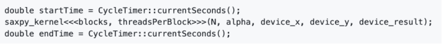

# F.CSM306-Lab02-Starter
**Зорилго:** GPU программчлалын үндсэн ойлголтууд, санах ойн удирдлага болон параллель алгоритмуудыг (SAXPY, Prefix Sum) CUDA ашиглан хэрэгжүүлж сурах.  

**I. ХЭСЭГ** CPU болон GPU хооронд өгөгдөл дамжуулах, мөн SAXPY (result[i] = a * x[i] + y[i]) алгоритмыг праллелчилна. Өгөгдөл дамжуулах хугацаа болон тооцооллын хугацааг тусад нь хэмжиж, GPU-ийн зурвасын өргөн (bandwidth)-ийг олно.

**Гүйцэтгэх даалгавар:** 
saxpy.cu файл дахь saxpyCuda функцийг гүйцэтгэж дуусгана. Үүнд:
1.	Санах ой хуваарилах: GPU-ийн global memory-д X, Y, болон result массивүүдад зориулж санах ой хуваарилна. N = 106 
2.	Өгөгдөл хуулах (Host to Device): Тооцоолол хийхээс өмнө CPU дээрх (Host) X, Y массивын утгуудыг GPU (Device) руу хуулна.
3.	Kernel ажиллуулах: GPU дээрх saxpy_kernel-ийг дуудаж ажиллуулна.
4.	Үр дүнг хуулах (Device to Host): Тооцоолол дууссаны дараа үр дүнг GPU-ээс CPU-ийн санах ой руу буцааж хуулна.

**Хугацаа хэмжих:** Даалгаврын хүрээнд дараах хоёр төрлийн хугацааг хэмж:
A.	Нийт хугацаа (Total Time) Эх кодод өгөгдөл хуулах (H to D), Kernel ажиллах, үр дүн буцааж хуулах (D to H) гэсэн бүх процессыг хамарсан хугацаа.
B.	Kernel ажиллах хугацаа (Kernel-only Time) Зөвхөн Kernel-ийн ажилласан хугацааг хэмжинэ. Үүнийг хийхдээ CUDA kernel-ийн дуудалт нь CPU-тэй синхрон биш (asynchronous) байдгийг анхаарах хэрэгтэй.
Хэрэв дараах байдлаар бичвэл:

Энэ нь Kernel-ийн бодит ажиллагааг биш, зөвхөн GPU руу "команд өгөх" API-ийн хугацааг хэмжиж, маш бага утга гарна. Тиймээс Kernel дуудсаны дараа cudaDeviceSynchronize() функцийг заавал ашиглаарай.

(images/Sync.png)
